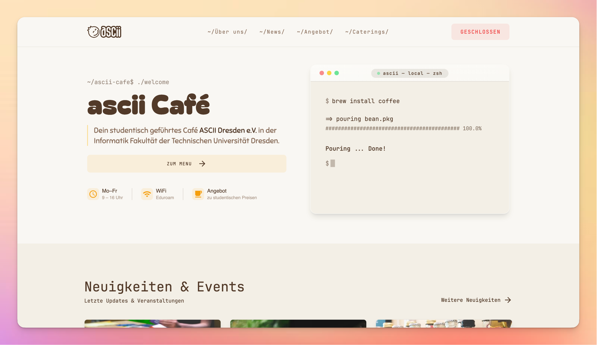

# ASCII Dresden

[](https://github.com/jannikmenzel/ASCII-Website/actions/workflows/lighthouse.yml)
[](LICENSE)
[](hugo.toml)
[](tailwind.config.js)
[](postcss.config.js)

Eine statische Website gebaut mit Hugo und Tailwind CSS.

## Projektübersicht

ASCII Dresden ist eine mehrsprachige (Deutsch/Englisch) statische Website/Blog, erstellt mit Hugo. Sie nutzt Tailwind CSS (PostCSS) für das Styling und ist so konzipiert, dass sie leicht erweitert und angepasst werden kann.

- Content in `content/` (zweisprachig: `de` + `en`).
- Layouts unter `layouts/` und Partial-Templates unter `layouts/_partials/`.
- Tailwind/PostCSS Pipeline konfiguriert in `postcss.config.js` und `tailwind.config.js`.

## Lighthouse Performance


## Voraussetzungen

> [!NOTE]
> Die angegebenen Versionen stellen sicher, dass alle Features (insbesondere Tailwind + PostCSS) korrekt funktionieren.

- Hugo (Version >= 0.112.0) — siehe `hugo.toml`.
- Node.js (empfohlen aktuelle LTS) und npm (oder ein alternativer Paketmanager).

## Schnellstart — lokal entwickeln

> [!TIP]
> Stelle sicher, dass **Hugo** und **Node.js (LTS)** installiert sind, bevor du mit dem Schnellstart beginnst.

### 1) Repository klonen

```bash
git clone https://github.com/jannikmenzel/ASCII-Website
cd ASCII-Website
```

### 2) Node-Abhängigkeiten installieren

```bash
npm install
# yarn install
# pnpm install
```

### 3) Hugo Server starten (lokal preview)

Installiere Hugo falls nötig und starte den dev-Server:

#### Hugo installieren

```bash
# macOS / Linux (mit Homebrew)
brew install hugo
```

```bash
# Windows (mit Chocolatey)
choco install hugo -y
```

Weitere Informationen findest du [hier](https://gohugo.io/getting-started/installing/).

```bash
hugo server
--disableFastRender
--ignoreCache
--noHTTPCache
--cleanDestinationDir
```

> [!IMPORTANT]
> Hugo liest Dateien aus `assets/` und nutzt beim Build automatisch deine **PostCSS- und Tailwind-Konfiguration**, sofern die Toolchain verfügbar ist.

### 4) Production Build

```bash
# Optional: CSS zuerst bauen
HUGO_ENVIRONMENT=production npx postcss assets/css/main.css -o static/css/main.css
# Dann Hugo für die Produktiv-Build:
hugo
# Ergebnisse werden in `public/` geschrieben
```

## Projektstruktur

- `assets/` — Quelldateien für CSS, Icons, Bilder.
  - `assets/css/main.css` — Tailwind-Imports und Basiskonfiguration.
  - `assets/icons/`, `assets/images/` — statische Medien.
- `content/` — Seiten und Posts (`de` / `en`).
- `layouts/` — Hugo-Layouts und Partials.
- `data/` — strukturierte Daten für Timeline und Menü.
- `hugo.toml` — Hugo-Konfiguration (Sprache, Module, Build-Optionen).
- `package.json` — Node devDependencies (Tailwind, PostCSS).
- `static/` — statische Dateien (Dokumente, Bilder).
- `public/` — generierte Site.

## Anpassung und Entwicklung

- Neue Seiten: `content/<lang>/...` oder `content/posts` für Blogeinträge.
- Templates: `layouts/_default/` und `layouts/_partials/` anpassen.
- Tailwind: Passe `tailwind.config.js` an (Farben, Font-Families, Content Pfade).
- PostCSS: `postcss.config.js` steuert die Pipeline; `HUGO_ENVIRONMENT` aktiviert `autoprefixer`.

## Maintaining

Diese Sektion beschreibt, wie du die Website pflegst und Inhalte aktualisierst (Blog-Artikel, Metadaten, Bilder, Menü, etc.).

### 1) Blog-Artikel erstellen / aktualisieren

- Der Content liegt unter `content/posts/` und ist zweisprachig: es gibt je Artikel separate Dateien für Deutsch und Englisch (z. B. `post-1.de.md` und `post-1.en.md`).
- Neue Artikel anlegen: Erstelle zwei Dateien (de + en) mit entsprechendem Front Matter. Beispiel-FrontMatter (YAML):

```yaml
---
title: "Mein Artikel"
tag: "POST"
tagColor: "bg-red-100 text-red-800"
date: "2026-01-01"
slug: "mein-artikel"
image: "images/mein-artikel.jpg"
description: "Kurzbeschreibung"
draft: false
layout: post
---
```

- Wichtige Felder: `title`, `date`, `description` (für SEO), `slug` (URL), `tag`, `draft` (true = nicht veröffentlichen), `image` (Pfad zu Bild in `assets/images` oder `static/images`).

### 2) Metadaten und Site-Konfiguration

- Site-weite Einstellungen (z. B. Titel, Sprache, Params) sind in `hugo.toml` konfiguriert.
- SEO-Meta-Texte: Falls du Meta-Texte global anpassen willst, bearbeite die Partial `layouts/_partials/seo.html` oder die einzelnen Seiten-Front-Matters.

### 3) Bilder verwalten

- Originale / Quelldateien: Lege größere Originalbilder in `assets/images/` (wird von Hugo/Resources verarbeitet) oder in `static/images/` wenn du sie unverändert ausliefern möchtest.
- Naming & Pfade: Verwende sprechende, kleingeschriebene Dateinamen ohne Leerzeichen, z. B. `mein-artikel-hero.jpg`.
- Optimierung: Wenn möglich, lade optimierte WebP/AVIF-Versionen hoch oder nutze die Optimierung durch

`` in **Markdown**

`{{ partial "image.html" (dict "src" /images/... "alt" Alt Text "class" "w-full") }}` in **HTML**

### 4) Deployment & Git-Workflow

- Branch-Workflow: Erstelle einen Feature-Branch (`feature/add-article`), committe Änderungen und öffne einen Pull Request.
- Commit-Nachricht: Kurz und prägnant, z. B. `feat(blog): add article "Mein Artikel" (de/en)`.
- Vor dem Merge: Lokale Vorschau prüfen und optional automatisierte Checks/CI (z. B. Lighthouse) laufen lassen.

### 5) Abhängigkeiten aktualisieren

- Node-Pakete aktualisieren:

```bash
npm update
npm audit fix
```

- Hugo-Version prüfen/aktualisieren (je nach Distribution, z. B. Homebrew):

```bash
brew upgrade hugo
```

### 6) Quick-Checklist vor jedem Deploy

- [ ] Alle Artikel nicht auf `draft: true` gesetzt, falls veröffentlicht.
- [ ] Bilder korrekt verlinkt und optimiert.
- [ ] Lokaler Build ohne Fehler (`hugo`), CSS vorhanden (`static/css/main.css`).
- [ ] Übersetzungen (`.de.md` / `.en.md`) synchron.

### Shortcodes

Das Projekt enthält mehrere Shortcodes unter `layouts/shortcodes/`. Hier eine kurze Erklärung zu jedem Shortcode, welche Parameter sie erwarten und ein Beispiel für die Nutzung:

- `image`
  - Zweck: Vereinfachtes Einbinden responsiver Bilder; leitet Parameter an die Partial `layouts/_partials/image.html` weiter, die Hugo Resources für responsive Srcsets benutzt.
  - Wichtige Parameter: `src` (Pfad, z. B. `images/mein-bild.webp`), `alt`, `class` (Tailwind-Klassen).
  - Beispiel (Markdown): ``

- `menu`
  - Zweck: Rendert das Menü (Getränke & Snacks) aus `data/menu.json` in der passenden Sprache.
  - Wichtige Parameter: `lang` (optional, z. B. `de` oder `en`; default: Seiten-Sprache).
  - Beispiel: `` oder einfach `` wenn die Seite die richtige Sprache hat.

- `timeline`
  - Zweck: Zeigt eine History-/Timeline-Ansicht basierend auf `data/history.json` (Schlüssel `history_de` / `history_en`).
  - Wichtige Parameter: `lang` (optional, überschreibt Seiten-Sprache).
  - Daten-Einträge können optional ein Feld `image` enthalten (`image: "images/cafe.webp"`), das mobil oberhalb des Textes und auf Desktop als Vorschaubild in der gegenüberliegenden Spalte angezeigt wird.
  - Beispiel: `` (die Daten werden aus `data/history.json` gezogen).

- `carousel`
  - Zweck: Ein leichtgewichtiges Bild-Carousel mit Controls und optionalem Autoplay (keine externen Bibliotheken).
  - Wichtige Parameter:
    - `images`: Komma-separierte Liste von Bildpfaden (z. B. `images/a.webp,images/b.webp`) — die Bilder sollten in `assets/images/` liegen, damit Hugo Resources sie verarbeiten kann.
    - `autoplay`: Sekunden (z. B. `4`) für automatische Weiterschaltung; `0` = aus.
    - `class`: Optional zusätzliche Tailwind-Klassen für den Wrapper.
  - Beispiel: ``

---

## Contribution

Beiträge sind willkommen:

1. Fork erstellen.
2. Feature-Branch anlegen.
3. Änderungen committen.
4. Pull Request öffnen.

## Kontakt

> [!NOTE]
> Bei Fragen oder Vorschlägen zur Website kannst du mich per E-Mail erreichen:
> **[jannik.menzel@ifsr.de](mailto:jannik.menzel@ifsr.de)**

## Lizenz

Der Sourcecode dieses Projektes ist unter der MIT Lizenz lizenziert. Details dazu findest du in der `LICENSE` Datei.
